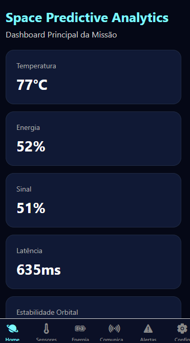
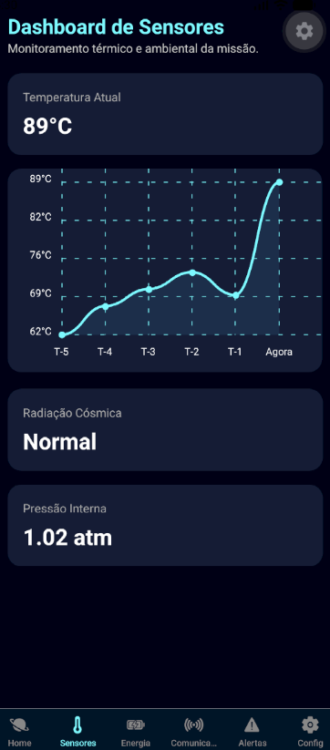
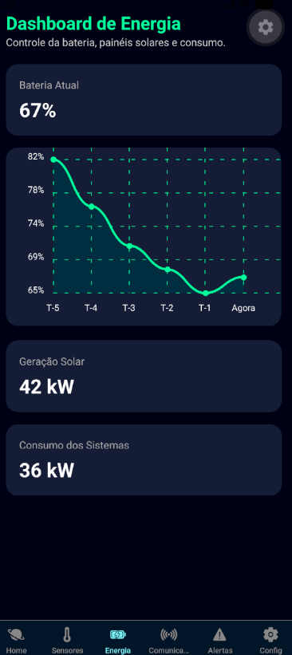
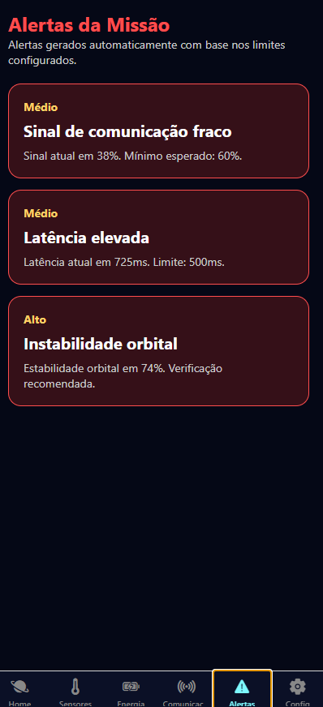
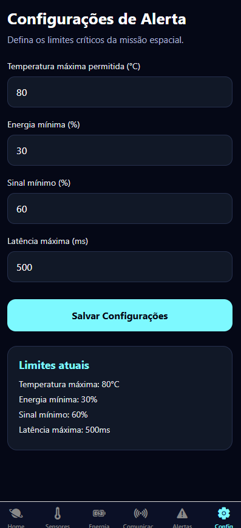

# 🚀 Space Predictive Analytics

### Global Solution 2026.1 — Cross-Platform Application Development | FIAP

---

# 📖 Descrição

O Space Predictive Analytics é um aplicativo mobile desenvolvido com React Native + Expo para monitoramento inteligente de sistemas espaciais simulados. A solução permite acompanhar indicadores críticos da missão, dashboards analíticos, comunicação orbital, sensores e energia da nave em tempo real simulado.

O aplicativo também possui geração automática de alertas, persistência de configurações com AsyncStorage e gerenciamento global de estado utilizando Context API.

---

# 👨‍🚀 Equipe

| Nome                   | RM       |
| ---------------------- | -------- |
| Vitor Barbosa de Paiva | RM565303 |
| Arthur Traldi Felix    | RM563477 |
---

# 📱 Telas do Aplicativo

## Home — Dashboard Principal



Visão geral dos indicadores da missão espacial.

---

## Dashboard de Sensores



Monitoramento dos sensores em tempo real.

---

## Dashboard de Energia



Indicadores de bateria e consumo energético.

---

## Dashboard de Comunicação


Status da telemetria e qualidade do sinal.

---

## Sistema de Alertas



Alertas automáticos baseados em limites críticos.

---

## Configurações



Formulário para configuração dos limites da missão.


---

# ⚙️ Funcionalidades

* [x] Dashboard principal da missão
* [x] Dashboard de sensores
* [x] Dashboard de energia
* [x] Dashboard de comunicação
* [x] Sistema automático de alertas
* [x] Persistência com AsyncStorage
* [x] Gerenciamento global com Context API
* [x] Navegação com Expo Router
* [x] Formulário validado
* [x] Interface responsiva com temática espacial

---

# 🛠 Tecnologias Utilizadas

* React Native
* Expo
* Expo Router
* TypeScript
* Context API
* AsyncStorage
* React Native Chart Kit
* Expo Vector Icons

---

# ▶️ Como Executar

## Pré-requisitos

* Node.js instalado
* Expo Go instalado no celular
* Android Studio Emulator ou dispositivo físico

---

## Instalação

Clone o repositório:

```bash
git clone https://github.com/VitorBarbosadePaiva/gs_appdev.git
```

Entre na pasta:

```bash
cd space-predictive-analytics
```

Instale as dependências:

```bash
npm install
```

Execute o projeto:

```bash
npx expo start
```

Escaneie o QR Code utilizando o aplicativo Expo Go.

---

# 🎥 Vídeo de Demonstração

[Clique aqui para assistir ao vídeo](https://youtube.com/)

---

# 📄 Licença

Este projeto foi desenvolvido para fins acadêmicos — FIAP 2026.
